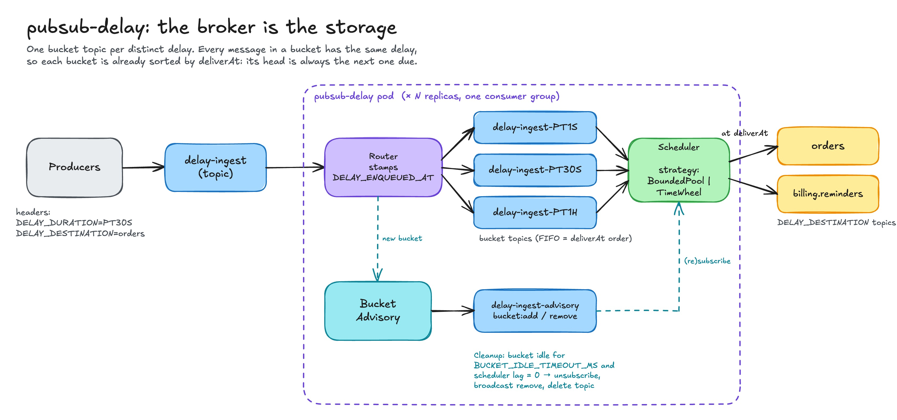
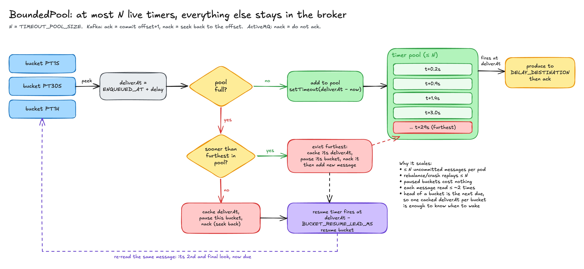
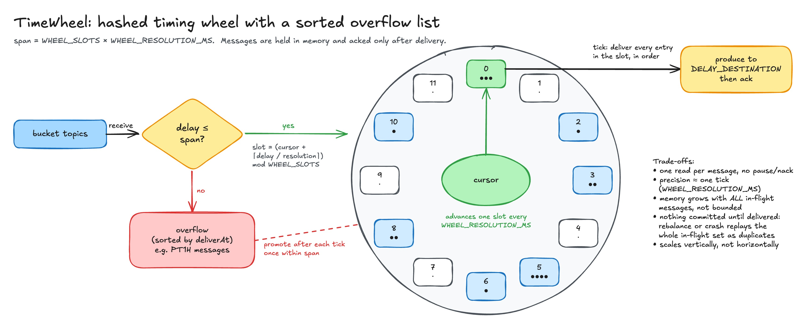

# pubsub-delay

A broker-agnostic **delayed message delivery** service for Kafka and ActiveMQ.

Producers publish a message to one ingest topic with two headers: how long to wait and where to send it. pubsub-delay produces the message to that destination once the delay has passed. The broker is the only storage. There is no database, no Redis and no local disk, and the service keeps almost no state of its own.

```
DELAY_DURATION:    PT30S      # ISO 8601 duration
DELAY_DESTINATION: orders     # topic to deliver to
```

## Why

Most [message queues](https://en.wikipedia.org/wiki/Message_queue) deliver immediately. Delayed delivery is needed for retries with backoff, reminders, timeouts, debouncing and "do X in 10 minutes" workflows. It is usually solved with one of these:

* **Broker-native scheduling** (ActiveMQ `AMQ_SCHEDULED_DELAY`, RabbitMQ delayed-exchange plugin). This is vendor-specific, and Kafka has nothing equivalent.
* **A database plus a poller.** This adds a second system of record, polling latency, and contention at scale.
* **In-memory timers.** Everything waiting has to fit in RAM, and a crash or restart loses or replays it all.

pubsub-delay takes a different approach. Messages stay in the broker until they are due, and the service decides only *when* to read them.

## Architecture



1. **Ingest.** Producers publish to `delay-ingest` with the `DELAY_DURATION` ([ISO 8601 duration](https://en.wikipedia.org/wiki/ISO_8601#Durations)) and `DELAY_DESTINATION` headers.
2. **Router.** The router runs the optional [pre-transform](#transforms), stamps `DELAY_ENQUEUED_AT` with the current time, and forwards the message to a **bucket topic** for that exact duration, e.g. `delay-ingest-PT30S`. It creates the bucket on first use.
3. **Bucket advisory.** New and removed buckets are broadcast on `delay-ingest-advisory`, so every replica (re)subscribes its scheduler without polling the broker.
4. **Scheduler.** The scheduler consumes all bucket topics and delivers each message to `DELAY_DESTINATION` at `deliverAt = DELAY_ENQUEUED_AT + DELAY_DURATION`, after the optional [post-transform](#transforms). *How* it waits is a pluggable strategy: [BoundedPool](#boundedpool) or [TimeWheel](#timewheel).
5. **Cleanup.** Cleanup runs in two phases, so a topic is never deleted while a scheduler is still subscribed to it:
   1. A bucket that has been idle for `BUCKET_IDLE_TIMEOUT_MS`, with a scheduler lag of 0, is unsubscribed on every pod and broadcast as removed. The removing pod keeps a *tombstone* for it, so periodic discovery does not re-add a topic that still exists.
   2. After `BUCKET_DELETE_GRACE_MS`, the removing pod deletes the topic if its lag is still 0. If messages arrived in the meantime, it re-adds the bucket instead.

   New traffic for a removed bucket re-registers it at any point.

### The key observation: a bucket is already sorted

Every message in a bucket has the same delay. Messages are appended in enqueue order, so a bucket is ordered by `deliverAt` for free, and **the head of each bucket is always the next message due in it**. The service never has to sort or index all pending messages. It only has to know the head of each bucket, so the whole backlog, whether it is millions of messages or hours long, stays in the broker.

### Ack and nack

Both strategies use the same broker-neutral semantics:

| | Kafka | ActiveMQ |
|---|---|---|
| **ack** | commit `offset + 1` | `ACK` (client-individual), confirmed by a receipt |
| **nack** | seek back to the message's offset (nothing is committed) | do not acknowledge; the consumer hands the message out again locally |

A nack is not a requeue, and nothing is sent back to the broker. The message is simply not acknowledged, and the same message is read again.

## Scheduling strategies

Pick a strategy with `SCHEDULER_STRATEGY`. Both run behind the same interface, so they can be compared side by side on identical traffic (see [Testing](#testing)).

### BoundedPool



BoundedPool is the default strategy and an original design for this project. It holds **at most `TIMEOUT_POOL_SIZE` messages** with live timers and leaves everything else unread in the broker.

1. **Peek** the head of a bucket and compute `deliverAt`.
2. **If the pool has room**, add the message with `setTimeout(deliverAt − now)`. When the timer fires, produce to `DELAY_DESTINATION`, then ack.
3. **If the pool is full**, compare the message with the one in the pool that is due furthest in the future.
   * **Sooner:** evict the furthest message. Nack it, cache its `deliverAt`, and pause its bucket. Then add the new message.
   * **Not sooner:** cache this message's `deliverAt`, pause this bucket, and nack.
4. **Resume.** A paused bucket gets one resume timer at `deliverAt − BUCKET_RESUME_LEAD_MS`. The broker then redelivers the same head message, which is now due.

Because the head of a bucket is its earliest message, **one cached `deliverAt` per paused bucket** is enough to know when to wake it. A paused bucket costs nothing: no fetches, no memory, no timers. A message is read at most about twice: an optional peek that ends in a nack, then the read that delivers it.

Properties:

* **Bounded memory.** Memory does not grow with the backlog: at most N messages are held in memory and uncommitted per pod.
* **Small replay window.** A crash or rebalance replays at most N messages.
* **Scales horizontally.** Replicas split bucket partitions through the consumer group, and there is no shared state to coordinate.
* **Precise.** Delivery runs on a per-message timer rather than a tick. The remaining latency is the cost of re-fetching a resumed bucket, which `SCHEDULER_FETCH_MAX_WAIT_MS` and `BUCKET_RESUME_LEAD_MS` keep small.

Keeping the N soonest deadlines and evicting the one due furthest in the future mirrors [Bélády's optimal cache replacement algorithm](https://en.wikipedia.org/wiki/Cache_replacement_policies#B%C3%A9l%C3%A1dy's_algorithm), which evicts the item needed furthest in the future. It is practical here because the deadlines are known exactly. The pool itself acts as a bounded [priority queue](https://en.wikipedia.org/wiki/Priority_queue) ordered by deadline, in the spirit of [earliest-deadline-first scheduling](https://en.wikipedia.org/wiki/Earliest_deadline_first_scheduling).

**Prior art.** Spring Kafka's [non-blocking retry topics](https://docs.spring.io/spring-kafka/reference/retrytopic/how-the-pattern-works.html) use a similar pause-until-due idea: if a message is not yet due, the consumer pauses that partition and resumes it when the message is due, then consumes the message again (see also its notes on [back-off delay precision](https://docs.spring.io/spring-kafka/reference/retrytopic/back-off-delay-precision.html)). Uber's [reliable reprocessing](https://www.uber.com/en-US/blog/reliable-reprocessing/) uses one topic per delay tier, like the bucket topics here. BoundedPool combines these ideas with a bounded, globally ordered timer pool and eviction across buckets.

### TimeWheel



TimeWheel is a classic **hashed timing wheel** with a sorted overflow list. It reads every message once and holds it in memory until delivery.

* The wheel has `WHEEL_SLOTS` slots, each `WHEEL_RESOLUTION_MS` wide, so its span is `slots × resolution`.
* A message due within the span goes into slot `(cursor + ⌈delay / resolution⌉) mod WHEEL_SLOTS`.
* A message due later goes into an overflow list sorted by `deliverAt` and is promoted into the wheel once it falls within the span.
* On each tick the cursor advances one slot and every entry in that slot is delivered, then acked.

Adding a timer and firing one are both O(1), and the bucket topics are never paused or nacked. The trade-offs:

* **Precision is about one tick.** Delivery is quantised to `WHEEL_RESOLUTION_MS`.
* **Memory is unbounded.** Every in-flight message is in RAM, so memory grows with the backlog.
* **Large replay window.** Nothing is committed until delivery, so a crash or rebalance replays the whole in-flight set as duplicates.
* **Scales vertically, not horizontally.** Adding pods only spreads partitions. Each pod still has to hold everything it has read, and a rebalance replays it.

There is no dedicated Wikipedia article on timing wheels. The closest entries are [calendar queue](https://en.wikipedia.org/wiki/Calendar_queue) and [bucket queue](https://en.wikipedia.org/wiki/Bucket_queue). Further reading:

* Varghese & Lauck, [*Hashed and Hierarchical Timing Wheels*](http://www.cs.columbia.edu/~nahum/w6998/papers/sosp87-timing-wheels.pdf) (SOSP 1987), the original paper
* Confluent, [Apache Kafka, Purgatory, and Hierarchical Timing Wheels](https://www.confluent.io/blog/apache-kafka-purgatory-hierarchical-timing-wheels/)
* Netty [`HashedWheelTimer`](https://netty.io/4.1/api/io/netty/util/HashedWheelTimer.html)
* LWN, [Reinventing the timer wheel](https://lwn.net/Articles/646950/) (Linux kernel)

### Comparison

Stress test on Kafka: 100 msg/s per strategy, delays PT1S–PT5S, defaults otherwise. Lateness is in milliseconds, measured at the destination consumer.

| Run | Strategy | Messages | Lost | Dup | avg | p50 | p95 | p99 | max | Peak RSS |
|---|---|---|---|---|---|---|---|---|---|---|
| 60 min | BoundedPool | 360,000 | 0 | 0 | 6.0 | 5 | 11 | 13 | 2718¹ | 73 MB |
| 60 min | TimeWheel | 360,000 | 0 | 0 | 14.7 | 12 | 35 | 41 | 59 | 73 MB |
| 3 min, after fix | BoundedPool | 18,010 | 0 | 0 | 5.6 | 5 | 11 | 14 | 53 | 74 MB |
| 3 min, after fix | TimeWheel | 18,010 | 0 | 0 | 14.7 | 12 | 35 | 42 | 58 | 72 MB |

¹ Before the fix, a resumed bucket could wait up to kafkajs's default 5 s long-poll before it was fetched. `SCHEDULER_FETCH_MAX_WAIT_MS` (default 100) now bounds that wait.

At every percentile BoundedPool is 2–3× tighter. The short test's backlog fits easily in RAM, so memory is similar at this load. The difference that matters shows up as the backlog grows (long delays or high volume): TimeWheel's memory and replay window grow with it, while BoundedPool's stay at N.

| | BoundedPool | TimeWheel |
|---|---|---|
| Memory | O(N) + O(buckets) | O(in-flight messages) |
| Reads per message | 1–2 | 1 |
| Replay on crash or rebalance | ≤ N | everything in flight |
| Precision | per-message timer plus re-fetch latency | ≈ one tick |
| Horizontal scaling | yes | limited |

**Scaling note.** Kafka parallelism is bounded by partitions. Bucket topics currently have one partition each, so each bucket is consumed by one pod at a time, while different buckets can land on different pods.

## Transforms

A transform plugin can change or reject a message at two points:

* **pre**, in the router, before the message is written to its bucket
* **post**, in the scheduler, after the delay and before delivery

Typical uses are encrypting or compressing a payload while it waits, a [claim check](https://www.enterpriseintegrationpatterns.com/patterns/messaging/StoreInLibrary.html) that parks a large body elsewhere, or an auth check on the `Authorization` header before a message is accepted.

A transform has three outcomes:

| Outcome | Effect |
|---|---|
| **forward** | Continue with the returned message |
| **reject** | Ack and drop the message (logged and counted) |
| **error** | Transient: wait `TRANSFORM_RETRY_BACKOFF_MS`, nack, and retry the same message |

`TRANSFORM_PLUGIN` selects the plugin. The default, `none`, forwards every message unchanged.

### HTTP plugin

`TRANSFORM_PLUGIN=http` POSTs each message to `TRANSFORM_PRE_URL` and/or `TRANSFORM_POST_URL`. Both are optional; a stage without a URL passes messages through unchanged.

Request body:

```json
{
  "stage": "pre",
  "topic": "delay-ingest",
  "destination": "orders",
  "key": "order-42",
  "headers": { "DELAY_DURATION": "PT30S", "Authorization": "Bearer ..." },
  "body": "<base64>"
}
```

`destination` is only sent on `post`. The body is base64, so binary payloads (compressed or encrypted) survive JSON.

| Response | Outcome |
|---|---|
| `200` with a JSON `{key?, headers?, body?}` | forward the returned message; omitted fields keep their original values |
| `204` | forward unchanged |
| `4xx` (except 408 and 429) | reject, e.g. `401` or `403` from an auth check |
| `5xx`, `408`, `429`, timeout, network error or malformed reply | error, retried |

The request times out after `TRANSFORM_HTTP_TIMEOUT_MS`. A pre-transform may change `DELAY_DURATION` or `DELAY_DESTINATION`; routing uses the headers it returns.

## ActiveMQ

`BROKER_TYPE=activemq` talks [STOMP](https://stomp.github.io/) to ActiveMQ Classic.

* **Buckets are queues.** Every pod consumes each bucket queue, and the broker load-balances messages across them. The advisory is a JMS topic (`/topic/...`), so every pod sees every bucket change.
* **Subscriptions change in place.** Adding or removing a bucket subscribes or unsubscribes just that queue, so in-flight messages are never handed back to the broker and redelivered.
* **Pause and nack are local.** A paused bucket's messages wait unacked in the pod, up to `ACTIVEMQ_PREFETCH` per bucket. A nacked message goes back to the front of its bucket.
* **Sends are persistent and confirmed.** Every send and ack waits for the broker's receipt.
* **Admin via Jolokia.** Listing, sizing (`QueueSize`) and deleting bucket queues goes through the web console's [Jolokia](https://jolokia.org/) endpoint, `ACTIVEMQ_JOLOKIA_URL`. Without it, queues are created on first use and idle buckets are never deleted.

### Message groups and keys

ActiveMQ [message groups](https://activemq.apache.org/components/classic/documentation/message-groups) (`JMSXGroupID`) are the equivalent of a Kafka message key: all messages of a group go to one consumer, in order. pubsub-delay sets `JMSXGroupID` from the message key on every send, so groups keep their consumer affinity on the bucket queues and on the destination.

ActiveMQ applies `JMSXGroupID` on SEND but does not include it in STOMP MESSAGE frames. The key therefore also travels in an ordinary header, `DELAY_KEY` (`KEY_HEADER`). Producers should set both:

```
JMSXGroupID: order-42     # group affinity on the ingest queue
DELAY_KEY:   order-42     # carries the key through the delay
```

Headers the broker sets per delivery (`destination`, `message-id`, `subscription`, `expires`, `priority` and so on, see `ACTIVEMQ_STRIP_HEADERS`) are dropped rather than forwarded.

## Metrics

`GET /metrics` on `HEALTH_PORT` serves Prometheus metrics, prefixed `pubsub_delay_`:

| Metric | Type | Labels |
|---|---|---|
| `pubsub_delay_delivery_lateness_ms` | histogram | `strategy`, lateness of actual produce versus `deliverAt` |
| `pubsub_delay_messages_total` | counter | `strategy`, `event` (`received`, `delivered`, `nacked`, `paused`) |
| `pubsub_delay_scheduler_messages` | gauge | `strategy`, `state` (`active`, `pending`, `paused`) |
| `pubsub_delay_transform_total` | counter | `plugin`, `stage`, `outcome` (`forwarded`, `rejected`, `failed`) |
| `pubsub_delay_transform_duration_ms` | histogram | `plugin`, `stage` |
| `pubsub_delay_process_*`, `pubsub_delay_nodejs_*` | default | process and event loop metrics |

`monitoring/prometheus.yml` scrapes both strategies in the stress stack, and Prometheus is available on http://localhost:19090.

## Testing

```sh
# Unit tests: HTTP transform plugin, router retry and reject paths
npm run test:unit

# Kafka integration tests: delivery, headers, bucket creation and idle cleanup, load, transforms
npm run test:integration && npm run test:integration:down

# ActiveMQ integration tests (two pods): the same, plus JMSXGroupID affinity and ordering
npm run test:integration:activemq && npm run test:integration:activemq:down

# Side-by-side correctness comparison of both strategies
docker compose -f docker-compose.compare.yml up --build --abort-on-container-exit --exit-code-from compare-test

# Stress test (defaults: 60 min at 100 msg/s per strategy)
STRESS_DURATION_MINUTES=3 docker compose -f docker-compose.stress.yml up --build --abort-on-container-exit --exit-code-from stress-test
```

The stress test fails on any lost or duplicated message. Ports on the stress stack: Kafka 19092, Kafka UI 18080, Prometheus 19090.

## Diagrams

The diagrams are generated from code, so they stay editable and reproducible:

* `scripts/generate-diagrams.mjs` writes `docs/diagrams/*.excalidraw`. The files open at [excalidraw.com](https://excalidraw.com).
* `scripts/render-diagrams.mjs` renders each file to `.jpg` with Excalidraw's own exporter in headless Chrome.

```sh
npm run docs:diagrams
```

## Configuration

All settings are environment variables.

### Broker

| Variable | Default | Description |
|---|---|---|
| `BROKER_TYPE` | `kafka` | `kafka` or `activemq` |
| `KAFKA_BROKERS` | `localhost:9092` | Comma-separated bootstrap servers |
| `KAFKA_CLIENT_ID` | `pubsub-delay` | Kafka client id |
| `ACTIVEMQ_HOST` | `localhost` | STOMP host |
| `ACTIVEMQ_PORT` | `61613` | STOMP port |
| `ACTIVEMQ_LOGIN` / `ACTIVEMQ_PASSCODE` | `admin` / `admin` | STOMP credentials |
| `ACTIVEMQ_PREFETCH` | `100` | Unacked messages the broker may push per bucket subscription |
| `ACTIVEMQ_RECONNECT_DELAY_MS` | `1000` | Wait before a consumer reconnects after losing its connection |
| `ACTIVEMQ_HEARTBEAT_MS` | `5000` | STOMP heartbeat interval, both directions |
| `ACTIVEMQ_HEARTBEAT_SEND_MARGIN_MS` | `1000` | Send heartbeats this much early; ActiveMQ allows no grace |
| `ACTIVEMQ_HEARTBEAT_RECEIVE_GRACE_MS` | `5000` | How late broker heartbeats may arrive |
| `ACTIVEMQ_STRIP_HEADERS` | see `src/config.ts` | Comma-separated per-delivery headers not forwarded |
| `ACTIVEMQ_JOLOKIA_URL` | | e.g. `http://activemq:8161/api/jolokia`; enables discovery and cleanup |
| `ACTIVEMQ_JOLOKIA_LOGIN` / `ACTIVEMQ_JOLOKIA_PASSWORD` | STOMP credentials | Jolokia credentials |
| `ACTIVEMQ_JOLOKIA_ORIGIN` | `http://localhost` | `Origin` header; Jolokia rejects requests without an allowed one |
| `ACTIVEMQ_BROKER_NAME` | discovered | Broker name in the JMX object names |
| `ACTIVEMQ_JOLOKIA_TIMEOUT_MS` | `5000` | Jolokia request timeout |

### Topics and headers

| Variable | Default | Description |
|---|---|---|
| `INGEST_TOPIC` | `delay-ingest` | Topic producers publish delayed messages to |
| `BUCKET_SEPARATOR` | `-` | Separator between ingest topic and duration in bucket names |
| `HEADER_PREFIX` | `DELAY_` | Prefix for all service headers |
| `DESTINATION_HEADER` | `${HEADER_PREFIX}DESTINATION` | Header naming the delivery topic |
| `DELAY_DURATION_HEADER` | `${HEADER_PREFIX}DURATION` | Header carrying the ISO 8601 delay |
| `ENQUEUED_AT_HEADER` | `${HEADER_PREFIX}ENQUEUED_AT` | Header stamped with the enqueue time (ms) |
| `KEY_HEADER` | `${HEADER_PREFIX}KEY` | ActiveMQ: header carrying the message key (see [Message groups](#message-groups-and-keys)) |
| `CONSUMER_GROUP_PREFIX` | `pubsub-delay` | Prefix for router, scheduler and advisory groups |
| `INSTANCE_ID` | `$HOSTNAME` | Static group membership id |

### Buckets

| Variable | Default | Description |
|---|---|---|
| `PRECREATE_BUCKETS` | | Comma-separated durations to create at startup, e.g. `PT1S,PT5M` |
| `BUCKET_IDLE_TIMEOUT_MS` | `3600000` | Idle time after which an empty bucket is unsubscribed everywhere |
| `BUCKET_DELETE_GRACE_MS` | `30000` | Wait between unsubscribing an idle bucket and deleting its topic |
| `CLEANUP_INTERVAL_MS` | `60000` | How often idle buckets are checked |
| `ADVISORY_SYNC_INTERVAL_MS` | `10000` | How often bucket topics are rediscovered from the broker |
| `TOPIC_CREATE_RETRIES` | `5` | Attempts to create required topics at startup |
| `TOPIC_CREATE_RETRY_BASE_MS` | `1000` | Linear backoff step between topic create attempts |

### Scheduler

| Variable | Default | Description |
|---|---|---|
| `SCHEDULER_STRATEGY` | `bounded-pool` | `bounded-pool` or `time-wheel` |
| `SCHEDULER_FETCH_MAX_WAIT_MS` | `100` | Max broker long-poll; bounds how late a resumed bucket is fetched |
| `CONSUMER_RESTART_GRACE_MS` | `5000` | Window for batching bucket changes into one resubscribe |
| `CONSUMER_START_TIMEOUT_MS` | `30000` | Give up on a (re)subscribe that hangs, and retry |
| `TIMEOUT_POOL_SIZE` | `100` | BoundedPool: max messages held with live timers |
| `BUCKET_RESUME_LEAD_MS` | `0` | BoundedPool: resume a paused bucket this early to absorb fetch latency |
| `WHEEL_RESOLUTION_MS` | `100` | TimeWheel: tick length |
| `WHEEL_SLOTS` | `600` | TimeWheel: slots per revolution (span = resolution × slots) |

### Router

| Variable | Default | Description |
|---|---|---|
| `ROUTER_RETRY_BACKOFF_MS` | `1000` | Wait before retrying a message the broker failed to accept |

### Transforms

| Variable | Default | Description |
|---|---|---|
| `TRANSFORM_PLUGIN` | `none` | `none` or `http` |
| `TRANSFORM_RETRY_BACKOFF_MS` | `1000` | Wait before retrying after a transform error |
| `TRANSFORM_PRE_URL` | | HTTP plugin: URL for the pre stage |
| `TRANSFORM_POST_URL` | | HTTP plugin: URL for the post stage |
| `TRANSFORM_HTTP_TIMEOUT_MS` | `5000` | HTTP plugin: request timeout |

### Service

| Variable | Default | Description |
|---|---|---|
| `HEALTH_PORT` | `8080` | Serves `/health`, `/ready` and Prometheus `/metrics` |

## License

[PolyForm Noncommercial 1.0.0](LICENSE.md)

**Permitted:** Personal use, research, education, non-profit, evaluation, hobby projects.

**Restricted:** Commercial use requires a separate license. [Contact the author](https://github.com/maxfortun) for commercial licensing.
